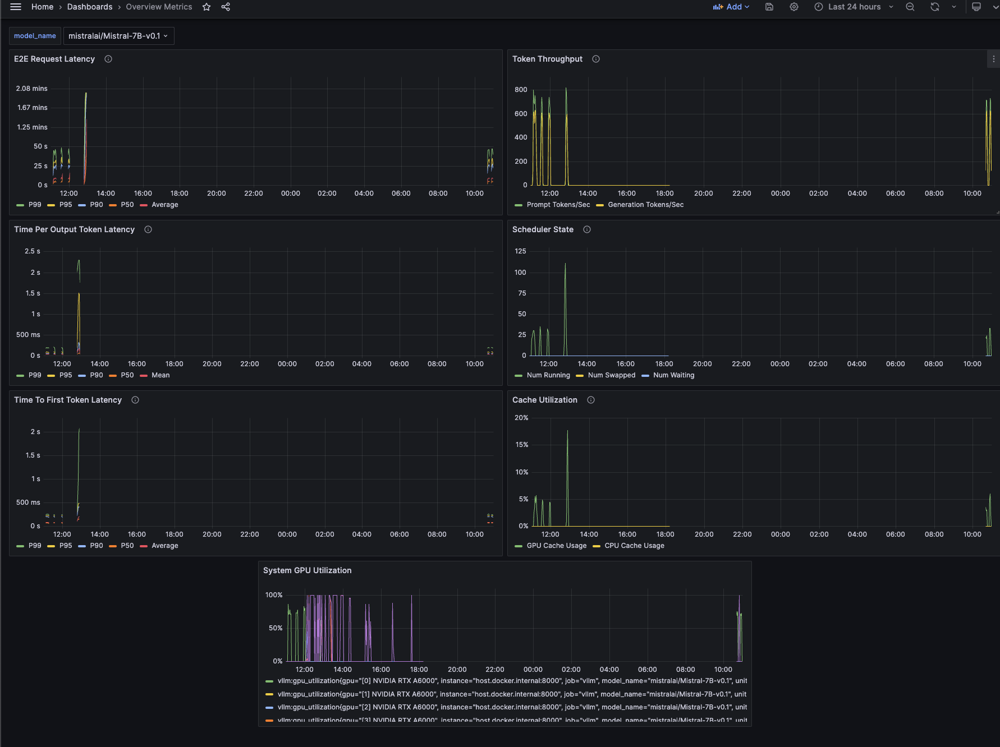

# Production Monitoring for nm-vLLM with Prometheus and Grafana 

## Log Frequency and General Info
By default, FastAPI server that nm-vLLM is hosted on logs at a defined frequency `t`, described in `vllm/entrypoints/openai/api_server.py` (currently set at 10 s). The async call will invoke both Python logger logs and Prometheus logs. 
Metric info per `t` interval are shown in both. Python logger shows instantaneous info, and Prometheus + Graphana can show its history with more custom user-defined metrics (eg. queries per second). 

Example python log:
```
INFO 03-07 21:49:49 metrics.py:211] Avg prompt throughput: 603.9 tokens/s, Avg generation throughput: 377.9 tokens/s, Running: 17 reqs, Swapped: 0 reqs, Pending: 0 reqs, GPU KV cache usage: 1.8%, CPU KV cache usage: 0.0%
```

Example Promethus + Graphana log visualization:



## Quick Start

This is a simple example that shows you how to connect nm-vLLM metric logging to the Prometheus/Grafana stack. For this example, we launch Prometheus and Grafana via Docker. You can checkout other methods through [Prometheus](https://prometheus.io/) and [Grafana](https://grafana.com/) websites. 

Install: 
- [`docker`](https://docs.docker.com/engine/install/)
- [`docker compose`](https://docs.docker.com/compose/install/linux/#install-using-the-repository)

### Commands

Prometheus metric logging is enabled by default in the OpenAI-compatible server. Launch via the entrypoint:
```bash
python3 -m vllm.entrypoints.openai.api_server \
    --model mistralai/Mistral-7B-v0.1 \
    --max-model-len 2048 \
    --disable-log-requests
```

Launch Prometheus and Grafana servers with `docker compose`:
```bash
cd examples/production_monitoring/
docker compose up
```

Submit some sample requests to the server:
```bash
wget https://huggingface.co/datasets/anon8231489123/ShareGPT_Vicuna_unfiltered/resolve/main/ShareGPT_V3_unfiltered_cleaned_split.json

python3 benchmarks/benchmark_serving.py \
    --model mistralai/Mistral-7B-v0.1 \
    --tokenizer mistralai/Mistral-7B-v0.1 \
    --endpoint /v1/completions \
    --dataset ShareGPT_V3_unfiltered_cleaned_split.json \
    --request-rate 3.0 \
    --backend openai

```

Navigating to [`http://localhost:8000/metrics`](http://localhost:8000/metrics) will show the raw Prometheus metrics being exposed by nm-vLLM.
Note: If using a remote machine, some servers may not be tunneled into the local machine. Run 
`ssh {user}@{ip} -L {port}:localhost:{port}`

## Grafana Dashboard

Navigate to [`http://localhost:3000`](http://localhost:3000). Log in with the default username (`admin`) and password (`admin`).

### Add Prometheus Data Source

Navigate to [`http://localhost:3000/connections/datasources/new`](http://localhost:3000/connections/datasources/new) and select Prometheus. 

On Prometheus configuration page, we need to add the `Prometheus Server URL` in `Connection`. For this setup, Grafana and Prometheus are running in separate containers, but Docker creates DNS name for each container. You can just use `http://prometheus:9090`.

Click `Save & Test`. You should get a green check saying "Successfully queried the Prometheus API."

### Dashboard Setup - Importing from json

Dashboards can be imported from the `json` config files in this repository. Navigate to [`http://localhost:3000/dashboard/import`](http://localhost:3000/dashboard/import), upload `nm-vllm-overview-metrics.json` for overview metrics; `nm-vllm-real-time-metrics.json` for real-time metrics and select the `prometheus` datasource. 

## Dashboards
There are two sample dashboards provided: Overview Metrics Dashboard and Real-Time Metrics Dashboard. Each dashboard can be imported from the 'json' config files in this repository. The overview dashboard shows metrics over the course of a longer interval (default set to 24 hours) in order to check the global health of your nm-vllm inference server. The real-time metrics dashboard shows metrics over a much shorter time frame (default set to 5 minutes) in order to provide live monitoring of the nm-vllm inference server. 

### Overview Metrics Dashboard
All of the metrics are time-series, where the x-axis is time (by default `t` minus 24 hours to current) and y-axis values vary by dashboard.
Some time series use percentile and average values - 99th, 95th, 90th, 50th. This will be referred as default percentiles
 
- **E2E Request Latency**
    * Histogram of end-to-end request latency in seconds over time.
- **Token Throughput**
    * Shows the prompt_token/s and generation_token/s over time.
- **Time to First Token Latency (TTFT)**
    * TTFT will show P50, P90, P95, and P99 TTFT latency in seconds. Histogram of time to first token in seconds.
- **Time Per Output Token Latency (TPOT)**
    * TPOT shows the inter-token latency between output tokens. Histogram of time per output token in seconds.
- **Scheduler State**
    * nm-vLLM uses a scheduler to manage job states which are `running`, `swapped`, and `waiting`. This graph shows the number of inference requests in RUNNING, WAITING, and SWAPPED states.
- **Cache Utilization**
    * Shows a percentage of used cache blocks by nm-vllm.
- **System GPU Utilization**
    * Shows the percent of GPU resources used, analogous to `nvidia-smi` output for each recognizable GPU(s).


### Real-Time Metrics Dashboard
The Real-Time Metrics Dashboard consists of two sections - Inference Request Metrics and Hardware Infrastructure Metrics. The logged metrics are shown as time-series or histogram. A time-series by default shows the history of the last 5 minutes. A histogram shows the distribution of the last 5 minutes of entries. 

#### Inference Request Metrics
- **Average Prompt Throughput**
    * Average prefill throughput, in tokens/s.
- **Average Generation Throughput**
    * Average generation throughput, in tokens/s.
- **Prompt Tokens**
    * Number of prefill tokens processed.
-  **Generation Tokens**
    * Number of generation tokens processed.
- **Time to First Token Latency (TTFT)**
    * TTFT will show P50, P90, P95, and P99 TTFT latency in seconds. Histogram of time to first token, in seconds.
- **Time Per Output Token Latency (TPOT)**
    * TPOT shows the inter-token latency between output tokens. Histogram of time per output token, in seconds.
- **Scheduler Running/Swapped/Waiting**
    * The number of running/swapped/waiting jobs.
- **Inference Compute Duration**
    * Histogram showing time, in seconds, for a job to be in the `RUNNING` state over the default of 5 min.
- **Inference Queue Duration**
    * Histogram showing time, in seconds, in the queue before the inference can be executed.

 #### Hardware Infrastructure Metrics
 - **GPU Cache Usage**
    * GPU cache usage (0.0 - 1.0).
 - **CPU Cache Usage**
    * CPU cache usage (0.0 - 1.0).
 - **GPU Temperature**
    * GPU temperature in Celsius.
 - **GPU Power Usage**
    * GPU instantaneous power, in watts.
 - **GPU Utilization**
    * 	GPU utilization rate (0.0 - 1.0). 
 - **GPU Total Memory**
    * Total GPU memory, in bytes.
 - **GPU Memory Used**
    * 	Used GPU memory, in bytes.

